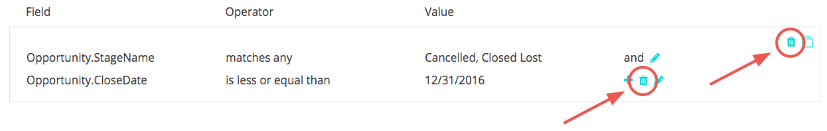

# Waarom u geen aanraakpunten wilt verwijderen {#why-you-should-never-delete-touchpoints}

Als u vindt dat er een aanraakpunt is op een Opportunity waaraan onjuist toewijzingskrediet wordt toegewezen, vraagt u uw accountmanager om de volgende stappen te bepalen. In deze situaties raden we u aan om het aanraakpunt uit SFDC en het ROI-dashboard te verwijderen met de functie voor het onderdrukken van aanraakpunten van de koper. Uw accountmanager kan u helpen deze regels te maken. Verwijder deze aanraakpunten niet handmatig.

Het [!DNL Marketo Measure] -verwerkingssysteem registreert niet dat een aanraakpunt handmatig uit SFDC is verwijderd. Vanaf vandaag is er geen trigger die ons systeem signalen geeft om gegevens aan te passen. [!DNL Marketo Measure] niet automatisch op een ander aanraakpunt duwen om het punt te vervangen dat is verwijderd, noch wordt de positie of het kenmerk van het aanraakpunt opnieuw toegewezen aan het volgende aanraakpunt.

Wanneer een aanraakpunt wordt verwijderd, ontstaat een gat in de toewijzingsgegevens. Typisch, zal dit in attributie aanraakpunten op een Kans duidelijk worden. In de onderstaande afbeelding is het aanraakpunt dat de Opportunity Creation-aanraking zou hebben gekregen, verwijderd. Als gevolg hiervan ontbreekt deze kans aan het aanraakpunt van de OC en zal het toewijzingspercentage voor deze Opp niet oplopen tot 100%.

Als de touchpoints van uw SFDC zijn geschrapt, reik uit aan [&#x200B; Steun van Marketo &#x200B;](https://nation.marketo.com/t5/support/ct-p/Support){target="_blank"} om een herinvoer van uw gegevens te verzoeken.
