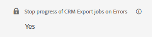

# Foutverwerking voor CRM-export

Met de functie Pauzeren bij exportfouten kunt u bepalen of CRM-exporttaken moeten worden gepauzeerd wanneer er een fout op recordniveau optreedt.

Het plaatsen kan onder **Mijn Rekening** worden gevonden > **Montages** > **CRM** > **Algemeen**.

>[!NOTE]
>Deze functie is alleen zichtbaar als u de functie Exporteren naar CRM hebt ingeschakeld.

Wanneer deze functie is ingeschakeld, gaat de exporttaak niet verder en blijft deze in de record waar de fout is opgetreden, totdat het probleem is opgelost. Deze fouten zijn gewoonlijk het gevolg van ontbrekende machtigingen, onjuist toegepaste aangepaste validatieregels of problemen in workflows/triggers. De taak wordt verder uitgevoerd zoals gepland en het exporteren van de mislukte record wordt automatisch hervat totdat deze is gelukt.

Als u deze functie uitschakelt, wordt een waarschuwingspop-up weergegeven met de melding dat dit tot inconsistenties in de gegevens kan leiden. Het is uw verantwoordelijkheid om eventuele problemen die uit deze inconsistenties kunnen voortvloeien, aan te pakken.

In beide gevallen, of de functie nu in- of uitgeschakeld is, worden alle aangetroffen fouten op recordniveau aangemeld in de tabel `ExportErrors` en probeert de `CRMExport_ExportError` -taak automatisch deze records dagelijks opnieuw te exporteren. Dit elimineert de behoefte aan een steunverzoek om een heruitvoer in werking te stellen, aangezien het automatisch zonder enige ontwikkelaarsinterventie zal gebeuren.

Waarom is het gedrag voor het stoppen van taken nodig gezien de `ExportErrors` -functionaliteit? Door de regelmatige de uitvoerbanen van CRM bij een specifiek verslag tegen te houden, wordt het oplossen van problemen veel gemakkelijker. Hiermee kunt u taken lokaal uitvoeren en voorkomen dat er een potentieel groot aantal ExportErrors wordt gemaakt, die tijdens het opnieuw exporteren moeten worden opgehaald en verwerkt.

Deze functie kan op basis van uw voorkeursgedrag in- of uitgeschakeld worden. Als u bijvoorbeeld een bijzonder uitdagende foutcode tegenkomt en de voorkeur geeft aan het tijdelijk accepteren van &#39;onvolledige&#39; gegevens, kunt u de functie uitschakelen. Als het probleem is opgelost, kunt u de functie weer inschakelen om ervoor te zorgen dat toekomstige exportbewerkingen volledig en nauwkeurig zijn.
