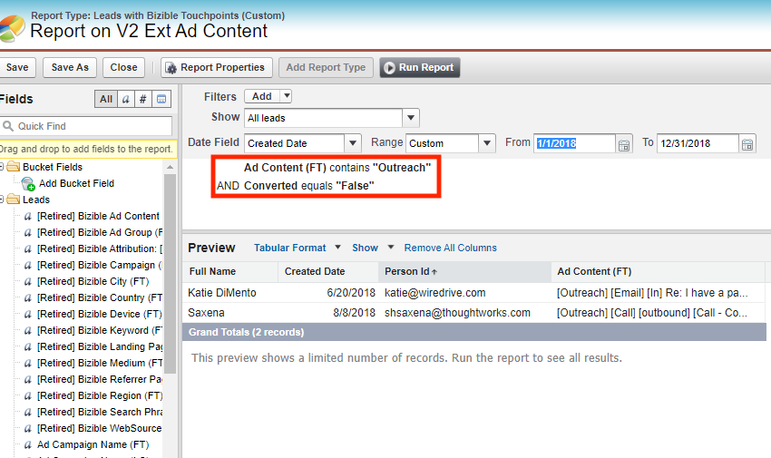

# [!DNL Salesforce] Pakketconsolidatie {#salesforce-package-consolidation}

We zijn erg blij dat we de komende wijzigingen in de Marketo Measure Salesforce Packages aankondigen. In een poging om de gebruikerservaring te verbeteren en het gebruik te vereenvoudigen, consolideren we alle bestaande pakketten in één, uitgebreid pakket.

## Pakketverlaging {#package-retirement}

Als gevolg van deze consolidatie zullen de huidige pakketten V1, V2_EXT, V2_Security en alle rapportagepakketten na augustus 2023 worden ingetrokken. Als u het V2-pakket al hebt geïnstalleerd, moet u het bijwerken naar de nieuwe geconsolideerde versie.

## Nieuw geconsolideerd pakket {#new-consolidated-package}

Het nieuwe geconsolideerde V2-pakket bevat alle functies en functies van de vorige pakketten, waardoor de gebruiker een betere ervaring krijgt. Dit bijgewerkte pakket maakt efficiëntere marketing en verkoopprestaties het volgen mogelijk en biedt meer inzicht in het gedrag van klanten.

We hebben twee nieuwe velden toegevoegd om uw rapportagemogelijkheden te verbeteren:

* form_name: Nu beschikbaar in BT/BAT-objecten, kunnen gebruikers in dit veld rapporten maken op basis van formuliernamen.
* user_touchpoint_id: Met dit veld kunnen gebruikers rapporten maken met unieke aantallen gebruikers-aanraakpunten (`bizible2__User_Touchpoint_V2__c` in Salesforce).

## Ondersteuning en overgang {#support-and-transition}

Wij begrijpen dat deze verandering aanpassingen kan vergen en wij zijn vastbesloten u gedurende het hele proces te steunen. Ons [Ondersteuningsteam](https://nation.marketo.com/t5/support/ct-p/Support){target="_blank"} is gemakkelijk beschikbaar om vragen te beantwoorden en te helpen zorgen voor een soepele overgang naar het nieuwe geconsolideerde pakket.

## Vereiste handelingen {#retired-actions}

* Als u het V2-pakket al hebt geïnstalleerd, moet u het bijwerken naar de nieuwe geconsolideerde versie.
* Als u rapporten of dashboards van om het even welk pakket van de Rapportering hebt, kunt u hen gemakkelijk zonder enige vereiste wijzigingen ontspannen, aangezien alle gebruikte gebieden in het geconsolideerde pakket bestaan.
* Als u rapporten hebt die gebieden in het V2_EXT pakket gebruiken, kunt u hen in het geconsolideerde pakket door de hieronder stappen opnieuw creëren:
   * Alle gegevens in V2_EXT-velden zijn beschikbaar in Touchpoint-velden. U kunt dus uw rapporten wijzigen om gegevens op te halen uit corresponderende V2-aanraakpuntvelden door een filter toe te voegen op de positie van het aanraakpunt.
   * Voorbeeldrapport waarin alle leads worden opgehaald met Ad Content FT die &quot;Outreach&quot;-tekst bevat.
      * V2_EXT-query:
         * bizible2_ext__Ad_Content_FT__c contains Outreach

* Overeenkomende query in het geconsolideerde pakket:
   * bizible2__Touchpoint_Position__c bevat FT AND
   * bizible2__Ad_Content__c bevat Outreach

## Veelgestelde vragen {#faq}

**Heeft het geconsolideerde pakket conflicten met velden in mijn bestaande pakket?**

U hoeft het pakket niet te verwijderen voordat u het geconsolideerde pakket installeert. Er treden geen conflicten op in velden omdat deze zich in een andere naamruimte bevinden.

**Hoe kan ik back-ups maken van de gegevens uit mijn huidige pakketten?**

U kunt een ticket indienen [met ondersteuning](https://nation.marketo.com/t5/support/ct-p/Support){target="_blank"} voor het terugvullen en opwerken van BT/BAT-gegevens om de velden Aanraakpunt-id en Formulier-id in te vullen.

**Zijn de velden in de pakketten V1 en V2_EXT beschikbaar in het geconsolideerde pakket?**

Ja. Het geconsolideerde pakket bevat dezelfde velden in V1 met verdere uitsplitsingen naar objecten en V2_EXT-velden via aanraakpuntvelden.

**Kunnen rapporten die V2_EXT gebieden gebruiken opnieuw worden gecreeerd in het geconsolideerde pakket?**

Ja. Volg de stappen in het dialoogvenster [Vereiste handelingen](#retired-actions) hierboven.
