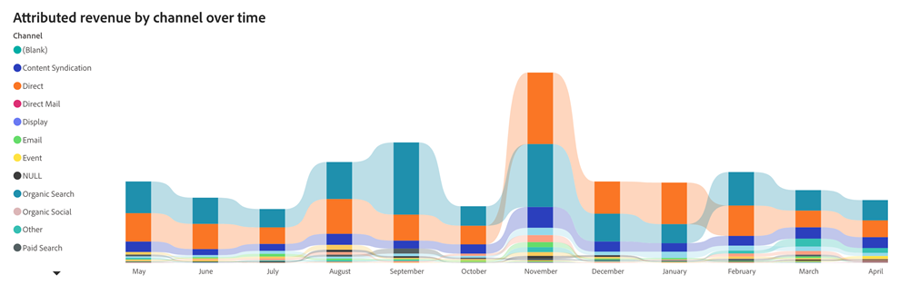

# Toegewezen belastingdashboard {#attributed-revenue-dashboard}

Het dashboard Toegewezen Inkomsten biedt een gericht perspectief op de inkomsten die rechtstreeks verband houden met uw marketingactiviteiten. Ontdek diepgaand hoe uw marketingstrategieën van nut zijn geweest bij het verzegelen van deals.

De antwoorden van de raad vragen:

Welke kanalen, subkanalen, of campagnes zijn het hoogst in termen van toegeschreven inkomsten?
Wat is het totale bedrag van onze toegerekende inkomsten en het aantal van onze toegeschreven gesloten overeenkomsten?

<table style="table-layout:auto"> 
<tbody>
  <tr> 
   <th>Component</th> 
   <th>Beschrijving</th>
   <th>Velden doorlopen</th>
   <th>Datumtype</th>
   <th>Filters</th>
  </tr>
  <tr>
    <td>Toegewezen inkomstentegel</td>
    <td>Totale toerekenbare inkomsten uit "Closed Won"-mogelijkheden met geregistreerde aanraakpunten.</td>
    <td rowspan="6"><li>Opportunity-id</li>
<li>Naam opportunity</li>
<li>Aanmaakdatum van opportunity</li>
<li>Datum van sluiting opportunity</li>
<li>Is gesloten (J/N)</li>
<li>Is gewonnen (Y/N)</li>
<li>Huidig werkgebied</li>
<li>Attributiemodel</li>
<li>Toegewezen inkomsten</li>
<li>Geregistreerde inkomsten</li></td>
    <td rowspan="6">Gesloten datum</td>
    <td rowspan="6"><li>Datum</li>
<li>Attributiemodel</li>
<li>Kanaal</li>
<li>Subkanaal</li>
<li>Campagne</li>
<li>Segmenten</li></td>
  </tr>
  <tr>
    <td>Attributable Deals Tile</td>
    <td>Het totale aantal "Gesloten overeenkomsten"van toe te schrijven kansen.</td>
  </tr>
  <tr>
    <td>Toegewezen opbrengsten per kanaal over tijd</td>
    <td>Gestapelde staafgrafiek met de totale toegerekende opbrengsten, gesegmenteerd door bijbehorend kanaal, voor elk kwartaal/maand.
     </td>
  </tr>
  <tr>
    <td>Toegewezen inkomstentabel</td>
    <td>De totale toegewezen opbrengst die door Kanaal, Subchannel, en Campagne wordt gesegmenteerd, in zowel de formaten van Tabular als van de Boom wordt voorgesteld.
     
     </td>
  </tr>
  </tr>
</tbody>
</table>

>[!MORELIKETHIS]
>
>[Basisprincipes van dashboard ontdekken](/help/marketo-measure-discover-ui/dashboards/discover-dashboard-basics.md){target="_blank"}
