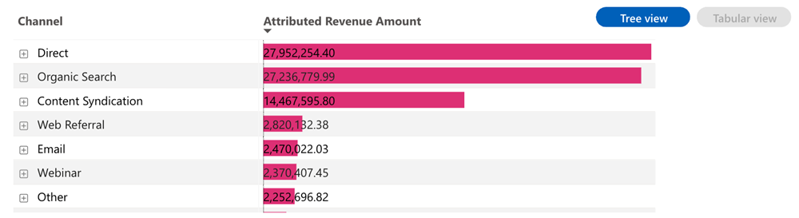

# Toegewezen belastingdashboard {#attributed-revenue-dashboard}

Het dashboard Toegewezen Inkomsten biedt een gericht perspectief op de inkomsten die rechtstreeks verband houden met uw marketingactiviteiten. Ontdek hoe uw marketingstrategieën van nut zijn geweest bij het verzegelen van deals.

>[!NOTE]
>
>Dit dashboard bevindt zich in bèta. Tijdens deze overgangsfase zullen zowel de huidige als de nieuwe dashboards toegankelijk zijn. Het huidige dashboard wordt vervangen nadat we volledig zijn overgeschakeld en optimale functionaliteit hebben gegarandeerd.

**De antwoorden van de raad vragen:**

* Welke kanalen, subkanalen, of campagnes zijn het hoogst in termen van toegeschreven inkomsten?
* Wat is het totale bedrag van onze toegerekende inkomsten en het aantal van onze toegeschreven gesloten overeenkomsten?

## Dashboardcomponenten {#dashboard-components}

### KPI-tegels {#kpi-tiles}

* **Toegewezen inkomsten**: De totale inkomstenbijdrage, gebaseerd op het gekozen toewijzingsmodel, van Opportunity with touchpoints.
* **Toegewezen overeenkomsten**: Het aantal &#39;Closed Won&#39;-kansen met aanraakpunten.

### Toegewezen opbrengsten per kanaal in tijdgrafiek {#attributed-revenue-by-channel-over-time-chart}

Gestapelde staafgrafiek met de totale toegerekende opbrengsten, gesegmenteerd door kanaal, voor elke Maand/Kwartaal/Jaar.

* Gebruik de functies voor uitvouwen en Omhoog om de gegevens te categoriseren op maand, kwartaal of jaar.
* Houd de cursor boven een staafsegment of de ruimte tussen de staven om gedetailleerde informatie weer te geven.

**Vragen in de grafiek:**

* Welke kanalen produceerden de meest toegeschreven inkomsten elk kwartaal?
* Wat was de uitsplitsing van de bestemmingsontvangsten per kanaal vorige maand?

### Toegewezen inkomstentabel {#attributed-revenue-table}

De totale toegewezen opbrengst die door Kanaal, Subchannel, en Campagne wordt gesegmenteerd, in zowel de formaten van Tabular als van de Boom wordt voorgesteld. Klik op de knop in de rechterbovenhoek om te schakelen tussen de weergaven.

**De antwoorden van de raad vragen:**

* Hoe varieert de toegewezen inkomstenverdeling tussen verschillende subkanalen binnen een kanaal?
* Welke campagnes onder een bepaald subkanaal drijven de meest toegeschreven inkomsten?

**Tabellarische weergave**

* De tabelweergave biedt duidelijke en georganiseerde inzichten in de verdeling van de toegewezen inkomsten. Gebruikers kunnen snel prestatiepatronen herkennen en marketingstrategieën met een hoog effect aanwijzen door gegevens te categoriseren in kanalen, subkanalen en campagnes.
* Klik op het pictogram &quot;+&quot; naast elk kanaal om de uitsplitsing naar subkanaal en campagne weer te geven.

**Boomstructuurweergave**

* De boomweergave maakt een interactieve en korrelere gegevensverkenning mogelijk, zodat marketeers trends, anomalieën of vooraanstaande personen kunnen identificeren in hun marketingactiviteiten.
* Klik op een vertakking om dieper in de volgende hiërarchische laag te gaan.

## Filtervenster {#filter-pane}

Dit dashboard is uitgerust met de volgende instellingen en filters:

* Datum (gebaseerd op einddatum)
* Attributiemodel
* Kanaal, subkanaal
* Campagne
* Segmenten

>[!MORELIKETHIS]
>
>* [Basisprincipes van dashboard ontdekken](/help/marketo-measure-discover-ui/dashboards/discover-dashboard-basics.md){target="_blank"}
>* [Zichtbaarheidsbeleid dashboardgegevens](/help/marketo-measure-discover-ui/dashboards/dashboard-data-visibility-policy.md){target="_blank"}

