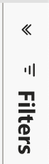

# Basisprincipes van dashboard ontdekken {#discover-dashboard-basics}

Dit artikel begeleidt u door de basismogelijkheden van de opnieuw ontworpen interface, zodat u uw gegevens moeiteloos kunt openen en interpreteren. Schrap in de dynamiek van de filterruit en ontdek de ingewikkeldheid van onze verbeterde rapporteringsfunctionaliteit, zoals de boor, dwars filtreren, en tooltips.

## Filtervenster {#filter-pane}

Elk dashboard heeft een reeks filters, vergezeld van de volgende besturingselementen voor naadloze navigatie en aanpassing.

<table style="table-layout:auto"> 
 <tbody> 
  <tr> 
   <th>Naam</th> 
   <th>Pictogram</th>
   <th>Beschrijving</th>
  </tr> 
  <tr> 
   <td>Hamburger Button</td> 
   <td></td>
   <td>Hiermee schakelt u het filtervenster in of uit.</td>
  </tr>
  <tr> 
   <td>Herstellen</td> 
   <td></td>
   <td>Hiermee herstelt u de standaardinstellingen van de filters.</td>
  </tr>
   <tr> 
   <td>Filters op visueel</td> 
   <td></td>
   <td>Houd de cursor boven de rechterbovenhoek van een visuele afbeelding en klik op de knop om de actieve filters weer te geven.</td>
  </tr>
 </tbody> 
</table>

## Rapportmogelijkheden {#report-capabilities}

### Omlaag en omhoog boren {#drill-down-and-up}

* Houd de muisaanwijzer boven een visueel element om te bepalen of het een hiërarchie heeft. De aanwezigheid van opties voor boorbesturing op de actiebalk geeft dit aan.

* Activeer de boor-down door de enige benedenpijl te klikken, die door een grijze achtergrond wordt benadrukt. Gebruik het boor-uppictogram om terug te keren.

Als u één veld tegelijk omlaag wilt boren, schakelt u het pictogram voor de keuzelijst in en selecteert u een visueel element, zoals een balk.

Gebruik het pictogram met de dubbele pijl om naar het volgende hiërarchische niveau te gaan.

Gebruik het vorkachtige pictogram om een extra hiërarchisch niveau in uw huidige mening toe te voegen.

### Doorboor {#drill-through}

* Als u de gegevens achter het visuele element wilt verkennen, klikt u met de rechtermuisknop op het visuele element en selecteert u de optie &quot;boor-through&quot;.

* Als u de onderliggende gegevens wilt exporteren, houdt u de muisaanwijzer boven de rechterbovenhoek van de doorlooppagina, klikt u op de knop &quot;Meer opties&quot; en selecteert u &quot;Gegevens exporteren&quot;.

* Als u wilt inzoomen op een bepaald visueel of naast elkaar geplaatste tegel, beweegt u de muisaanwijzer over de rechterbovenhoek en selecteert u de knop &quot;Focus&quot;.

### Gekruist filteren {#cross-filtering}

Door gebrek, zal het selecteren van een waarde of een asetiket in één visualisatie andere visuals op de rapportpagina kruisen, die ervoor zorgen zij slechts de relevante, gefilterde gegevens tonen.

### Knopinfo {#tooltips}

Knopinfo bevat aanvullende informatie over de weergegeven gegevens. Als u de muisaanwijzer op een visueel element plaatst en er een contextafhankelijke knopinfo verschijnt die inzichten of uitleg verschaft over dat specifieke gegevenspunt.

