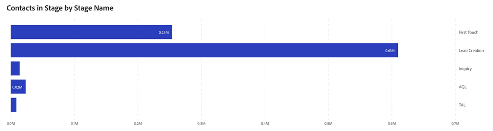

# Paspoort-dashboard {#passport-dashboard}

Het Paspoort-dashboard biedt marketers een dynamische weergave van leads, contactpersonen en opportuniteiten terwijl ze verschillende fasen binnen een bepaalde periode doorlopen. Door voor een specifieke datum te filteren, kunnen de gebruikers een momentopname van verslagen voor die dag ook verkrijgen.

De antwoorden van de raad vragen:

* Hoeveel lood, contacten, of kansen bestonden in elke niet-eindfase op om het even welke gekozen dag?
* Hoeveel verschillende leads of contactpersonen zijn er gedurende een bepaalde periode doorgegaan in elk overgangsstadium?
   * _Voorbeeld_: Indien Lood A op 1 januari 2023 in de eerste fase was en op 3 december 2023 naar fase 5 was gevorderd, zou de analyse van het paspoort Q1 2023 in de eerste fase tot en met 5 leiden tot Lood A.
* Hoeveel unieke Kansen ging door elk transient stadium tijdens een bepaald tijdkader over?

<table style="table-layout:auto"> 
<tbody>
<tr> 
   <th>Component</th> 
   <th>Beschrijving</th>
   <th>Datumtype</th>
   <th>Velden doorlopen</th>
   <th>Filters</th>
  </tr>
  <tr>
    <td>Kansen</td>
    <td><li>Elk stadium toont het aantal Kansen met BBTs die door hen in een bepaald tijdsbestek zijn overgegaan.</li>
<ul style="padding-left: 30px;"><li>Als een Kans door veelvoudige stadia binnen die spanwijdte vordert, worden zij geteld in elk stadium het overging.</li></ul>
<li>Eindfasen zoals "Closed Won" en "Closed Lost" zijn uitgesloten.</li>
<li>Zowel begin- als einddatum zijn inclusief.</li>
 </td>
    <td rowspan="2">Overgangsdatum</td>
    <td></td>
    <td rowspan="2"><li>Datum</li>
<li>Kanaal</li>
<li>Subkanaal</li>
<li>Campagne</li>
<li>Segmenten</li></td>
  </tr>
  <tr>
    <td>Leads/contactpersonen</td>
    <td><li>In elk stadium wordt het aantal leads of contactpersonen met BT's weergegeven dat ze binnen een bepaald tijdsbestek hebben doorlopen.</li>
<ul style="padding-left: 30px;"><li>Of ''Lead'' of ''Contact'' wordt weergegeven, wordt bepaald door de voorkeursinstelling die is ingesteld in: Instellingen &gt; Kenmerken &gt; Standaarddashboardobject.</li></ul>
<li>Eindfasen zoals "Closed Won" en "Closed Lost" zijn uitgesloten.</li>
<li>Zowel begin- als einddatum zijn inclusief.</li>
 </td>
    <td><li>Id van lead/contactpersoon</li>
<li>E-mailadres voor lead/contact</li>
<li>Aanmaakdatum</li>
<li>Huidig werkgebied</li>
<li>Overgang in datum</li>
<li>Verouderingsdatum overgang</li></td>
  </tr>
</tbody>
</table>
