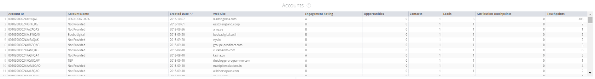

# OPS-blokken marketing {#marketing-ops-tiles}

Met marketingtips kunt u valideren en diagnostiseren [!DNL Marketo Measure] gegevens met volledige zichtbaarheid in afzonderlijke aanraakpunten per lead, contactpersoon, account, campagne en opportunity.

<table> 
 <colgroup> 
  <col> 
  <col> 
  <col> 
  <col> 
  <col> 
  <col> 
  <col> 
  <col> 
  <col> 
  <col> 
  <col> 
  <col> 
  <col> 
 </colgroup> 
 <tbody> 
  <tr> 
   <td> </td> 
   <td>
<strong>Account-id</strong>
</td> 
   <td>
<strong>Accountnaam</strong>
</td> 
   <td>
<strong>Opp-id</strong>
</td> 
   <td>
<strong>Opp-naam</strong>
</td> 
   <td>
<strong>Lead of contactpersoon-id</strong>
</td> 
   <td>
<strong>E-mailadres voor lead of contact</strong>
</td> 
   <td>
<strong>Campagne-id</strong>
</td> 
   <td>
<strong>Opp Won</strong>
</td> 
   <td>
<strong>Aanmaakdatum opp</strong>
</td> 
   <td>
<strong>Datum Sluiten</strong>
</td> 
   <td>
<strong>Aanraakpuntdatum</strong>
</td> 
   <td>
<strong>Attributiemodel</strong>
</td> 
  </tr> 
  <tr> 
   <td>
<strong>Accounts</strong>
</td> 
   <td><strong>X</strong></td> 
   <td><strong>X</strong></td> 
   <td><strong>X</strong></td> 
   <td><strong>X</strong></td> 
   <td><strong>X</strong></td> 
   <td> </td> 
   <td><strong>X</strong></td> 
   <td><strong>X</strong></td> 
   <td><strong>X</strong></td> 
   <td><strong>X</strong></td> 
   <td><strong>X</strong></td> 
   <td><strong>X</strong></td> 
  </tr> 
  <tr> 
   <td>
<strong>Opportunity</strong>
</td> 
   <td><strong>X</strong></td> 
   <td><strong>X</strong></td> 
   <td><strong>X</strong></td> 
   <td><strong>X</strong></td> 
   <td><strong>X</strong></td> 
   <td> </td> 
   <td><strong>X</strong></td> 
   <td><strong>X</strong></td> 
   <td><strong>X</strong></td> 
   <td><strong>X</strong></td> 
   <td><strong>X</strong></td> 
   <td><strong>X</strong></td> 
  </tr> 
  <tr> 
   <td>
<strong>Contactpersonen</strong>
</td> 
   <td><strong>X</strong></td> 
   <td><strong>X</strong></td> 
   <td><strong>X</strong></td> 
   <td><strong>X</strong></td> 
   <td><strong>X</strong></td> 
   <td><strong>X</strong></td> 
   <td><strong>X</strong></td> 
   <td><strong>X</strong></td> 
   <td><strong>X</strong></td> 
   <td><strong>X</strong></td> 
   <td><strong>X</strong></td> 
   <td><strong>X</strong></td> 
  </tr> 
  <tr> 
   <td>
<strong>Leads</strong>
</td> 
   <td><strong>X</strong></td> 
   <td><strong>X</strong></td> 
   <td><strong>X*</strong></td> 
   <td><strong>X*</strong></td> 
   <td><strong>X</strong></td> 
   <td><strong>X</strong></td> 
   <td><strong>X</strong></td> 
   <td><strong>X*</strong></td> 
   <td><strong>X*</strong></td> 
   <td><strong>X*</strong></td> 
   <td><strong>X</strong></td> 
   <td><strong>X</strong></td> 
  </tr> 
  <tr> 
   <td>
<strong>Campagnes</strong>
</td> 
   <td><strong>X</strong></td> 
   <td><strong>X</strong></td> 
   <td><strong>X</strong></td> 
   <td><strong>X</strong></td> 
   <td><strong>X</strong></td> 
   <td> </td> 
   <td><strong>X</strong></td> 
   <td><strong>X</strong></td> 
   <td><strong>X</strong></td> 
   <td><strong>X</strong></td> 
   <td><strong>X</strong></td> 
   <td><strong>X</strong></td> 
  </tr> 
 </tbody> 
</table>

## Accounttegel {#account-tile}

Hier worden de volgende gegevens weergegeven met betrekking tot de opgegeven account(s).

**Accounts moeten aanraakpuntgegevens hebben (alleen van toepassing als ABM is ingeschakeld)**

-Account ID: Account ID in CRM

-Accountnaam: rekeningnaam in CRM

-Gemaakt op: Aanmaakdatum van de rekening in de CRM

* Boor-down: Zie Gemaakt Datum door Uur, Minuut, Tijd

-Web Site: waarde in het veld Website op de account

- Betrokkenheidsscore: voorspellende betrokkenheidsscore (PSE) gevuld door [!DNL Marketo Measure]^1

-Opportunity: Number of Opportunity connected to the account

* Drill-down: Zie details voor de bijbehorende Kans(en)

-Contacten: Aantal Contacten die op deze rekening worden vermeld

* Boor-down: Zie details voor de bijbehorende contacten

-Leads: aantal leads dat aan dit account is toegewezen via lead in accounttoewijzing^1

* Inboor-down: Zie details voor de lood die aan de rekening in kaart zijn gebracht

-Attribution Touchpoints: Number of Buyer Attribution Touchpoints for the account

* Drill-down: Zie details van het aanraakpunt voor koperkenmerken (ID, e-mail, aanraakpunt, datum, accountnaam, campagne, kanaal, subkanaal, type marketingaanraking, kenmerkmodel)

-Touchpoints: Het aantal aanraakpunten dat de contactpersonen op dit account hebben^2

* Drill-down: Zie Touchpoints op de gegevens van het aanraakpunt van de account (ID, E-mail, Aanraakpunt Datum, Accountnaam, Campagne, Kanaal, Subkanaal, Type marketingaanraking)

>[!NOTE]
>
>Als u ABM hebt, worden de aanraakpunten weergegeven die gerelateerd zijn aan de leads die zijn toegewezen via Toewijzing van lead to-account.

## Opportunity-tegel {#opportunity-tile}

Geeft de volgende gegevens weer met betrekking tot de opgegeven opportunity(en).

-Opportunity ID: Opportunity ID in CRM

-Opportunity Name: Opportunity name in CRM

-Accountnaam: accountnaam gekoppeld aan de opportuniteit

-Gemaakt op: Aanmaakdatum van de opportuniteit in de CRM

Boor-down: Zie Gemaakt Datum door Uur, Minuut, Tijd

-Close Date: Closed Date of the Opportunity in the CRM

Inleiding: Zie Datum sluiten op Uur, minuut, tijd

-Amount: The total amount of the Opportunity

-Contacten: Aantal Contacten verbonden aan de Kans

Boor-down: Zie details voor de bijbehorende contacten

-Attributie-aanraakpunten: Aantal gerelateerde aanraakpunten voor koperkenmerken

Drill-down: Zie details van het aanraakpunt voor koperkenmerken (ID, e-mail, aanraakpunt, datum, accountnaam, campagne, kanaal, subkanaal, type marketingaanraking, kenmerkmodel)

## Contactegel {#contacts-tile}

Hier worden de volgende gegevens weergegeven met betrekking tot de opgegeven contactpersoon of contactpersonen.

-Contact-ID: contactpersoon-ID in CRM

-Email: Contact opnemen met e-mailadres

-Aanmaakdatum: aanmaakdatum van de contactpersoon in de CRM

* Boor-down: Zie Gemaakt Datum door Uur, Minuut, Tijd

-Accountnaam: accountnaam die is gekoppeld aan de contactpersoon

-Attribution Touchpoints: Number of Buyer Attribution Touchpoints for the contact

* Drill-down: Zie details van het aanraakpunt voor koperkenmerken (ID, e-mail, aanraakpunt, datum, accountnaam, campagne, kanaal, subkanaal, type marketingaanraking, kenmerkmodel)

-Touchpoints: Number of Buyer Touchpoints for the contact

* Boor-down: Zie Contacten op de gegevens van het aanraakpunt van de rekening (identiteitskaart, E-mail, Aanraakpunt Datum, de Naam van de Rekening, Campagne, Kanaal, Subchannel, het Type van Aanraak van de Marketing)

## Leadtegel {#leads-tile}

Hiermee geeft u de volgende gegevens weer met betrekking tot de opgegeven lead(s).

-ID lead: ID lead in CRM

-Email: e-mailadres voor eerste record

-Aanmaakdatum: wanneer de lead is gemaakt in de CRM

* Boor-down: Zie Gemaakt Datum door Uur, Minuut, Tijd

-Company (van Lood): Het bedrijf dat op het verslag in CRM vermeld is bevolkt door klant

-Account Name: The account name [!DNL Marketo Measure] wordt gevuld op basis van onze toewijzing van leads voor account

-Touchpoints: Het aantal aanraakpunten dat is gekoppeld aan de lead(s)

* Boor-down: Zie Contacten op de gegevens van het aanraakpunt van de rekening (identiteitskaart, E-mail, Aanraakpunt Datum, de Naam van de Rekening, Campagne, Kanaal, Subchannel, het Type van Aanraak van de Marketing)

## Campagne Tile {#campaigns-tile}

Hiermee geeft u de volgende gegevens weer met betrekking tot de opgegeven campagne(s).

-Campagne-id: campagne-id in CRM

-Campagnenaam: Campagnenaam in CRM

-Campagne-uitgaven: De uitgaven [!DNL Marketo Measure] heeft opgenomen met betrekking tot de campagne

-Attributiemodel: hiermee wordt de juiste toewijzing weergegeven op basis van het geselecteerde model

-Attribution Touchpoints: The number of Buyer Attribution Touchpoints associated to the campagne(s)

* Drill-down: Zie details van het aanraakpunt voor koperkenmerken (ID, e-mail, aanraakpunt, datum, accountnaam, campagne, kanaal, subkanaal, type marketingaanraking, kenmerkmodel)

-Touchpoints: Het aantal aanraakpunten dat is gekoppeld aan de campagne(s)

* Boor-down: Zie Contacten op de gegevens van het aanraakpunt van de rekening (identiteitskaart, E-mail, Aanraakpunt Datum, de Naam van de Rekening, Campagne, Kanaal, Subchannel, het Type van Aanraak van de Marketing)
