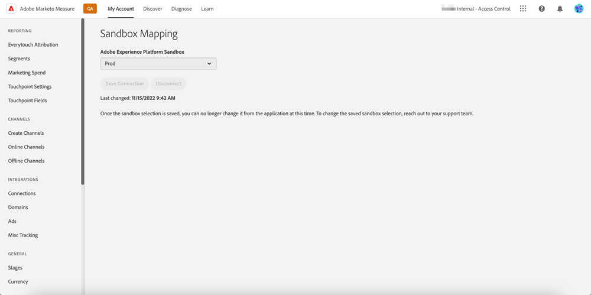

# [!DNL Marketo Measure] Ultieme overzicht {#marketo-measure-ultimate-overview}

[!DNL Marketo Measure] (voorheen Bizible) geeft marketeers inzicht in welke marketinginspanningen het meest effectief zijn in het aansturen van inkomsten en het maximaliseren van het rendement van investeringen voor hun bedrijf. [!DNL Marketo Measure] is een marketingtoewijzingsoplossing die de kanaalprestaties automatisch bijhoudt en rapporteert, zodat u kunt zien in welke kanalen de meeste betrokkenheid van klanten drijft en uw marketinguitgaven dienovereenkomstig kunt optimaliseren.

[!DNL Marketo Measure Ultimate] bevat de extra mogelijkheden:

* Maak gebruik van bijna elke gegevensbron en meerdere gegevensbronnen van hetzelfde type om al uw gegevens voor attributie in te voeren.
   * Gebruik met bijna om het even welke CRM, niet alleen Salesforce en Dynamica.
   * Sluit meerdere CRM-instanties en/of MAP-instanties aan op één [!DNL Marketo Measure] -instantie.
   * Gegevens over webinaire registratie en deelname van derden beschikbaar maken.

* Transformeer uw gegevens op zeer flexibele wijze met behulp van de veldomzetting en transformatiemogelijkheden voor de juiste gegevensvorm.

* Maak attributieinzichten beschikbaar aan externe toepassingen door het inbegrepen gegevenspakhuis om de inzichten in uw werkschema te integreren. Meer gegevens over resultaten en op BI gebaseerde rapportage, waaronder de Data Warehouse van Snowflaken, die toegang biedt tot gegevens over resultaten in korrelvorm en de mogelijkheid om een BI-instrument voor analyse en rapportage te gebruiken.

* Integratie met RTCDP (B2B of B2P Edition), die een geïntegreerde B2B-attributieoplossing biedt voor RTCDP-klanten als RTCDP en [!DNL Marketo Measure] beide werken vanuit gecentraliseerde Adobe Experience Platform (AEP)-gegevens.

**[!DNL Marketo Measure]Niveaus 1-3**

**[!DNL Marketo Measure Ultimate]**

## Nieuwe functies in [!DNL Marketo Measure Ultimate] {#whats-new-in-marketo-measure-ultimate}

**de Gegevens van de Invoer B2B door AEP**

Van markeerders wordt verwacht dat zij hun B2B-gegevens (bijvoorbeeld account, opportunity, Contact, lead, campagne, campagnemiddel, activiteit) via AEP doorgeven. De directe verbindingen van CRM en van het Marketo Engage zijn niet meer beschikbaar voor Ultimate. Marketers blijven gegevens van het Advertentieplatform leveren via directe verbindingen en webactiviteiten volgen via [!DNL Marketo Measure] javascript.

**StandaardInstelling van de Valuta**

[!DNL Marketo Measure Ultimate] stelt de standaardvaluta in op USD totdat de gebruiker deze wijzigt. Als u een nieuwe standaardvaluta instelt, worden de gegevens bijgewerkt zonder dat ze opnieuw worden verwerkt. Zolang de geselecteerde valuta als doel-ISO-code aanwezig is, is het niet nodig conversiekoersen in te dienen.

**[!DNL Marketo Measure Ultimate]Sandbox**

[!DNL Marketo Measure Ultimate] -instantie moet worden toegewezen aan een AEP-sandbox voordat de [!DNL Marketo Measure] -doelgegevensstromen in AEP worden gemaakt.

>[!NOTE]
>
>Een [!DNL Marketo Measure Ultimate] -productie-instantie moet worden toegewezen aan een AEP-productiestandaard, een [!DNL Marketo Measure Ultimate] -ontwikkelingsinstantie moet worden toegewezen aan een AEP-ontwikkelaarssandbox.

Wanneer de selectie van de sandboxtoewijzing is opgeslagen, kunt u deze niet meer wijzigen in de toepassing. Om het te veranderen, bereik uit aan [ de Steun van Marketo ](https://nation.marketo.com/t5/support/ct-p/Support){target="_blank"} .

De gegevens voor een bepaalde entiteit (bijvoorbeeld, Rekening) van een bepaalde gegevensbron kunnen slechts in één dataset gaan. Elke dataset kan slechts in één gegevensstroom worden omvat. Overtredingen stoppen de gegevensstroom bij uitvoering.

**Toewijzing van het Stadium**

Alle [!DNL Marketo Measure Ultimate] -regels zijn specifiek voor een gegevensset. Er moeten regels voor werkgebiedtoewijzing worden gemaakt voor alle gegevenssets en alle geselecteerde fasen.

Er zijn zes ingebouwde stappen:

* Loodverlies
* Openen van lead
* Lood omgezet
* Opportunity verloren
* Opportunity open
* Opportunity Won

De secties Verlies, Won en Omgezet staan geen aangepaste stadia toe. Source-gegevens kunnen echter worden toegewezen aan de ingebouwde stappen Verlies/Won/Omgezet door de toewijzingsregel bij te werken.

Aangepaste stadia kunnen alleen worden gedefinieerd voor Open secties.
CRM-fasen worden niet meer automatisch in de werkgebiedtoewijzing opgenomen.

Vier ingebouwde stappen moeten met regels worden in kaart gebracht (toewijzingsregels voor de andere twee, Lead Lost en Lead Converted, zijn facultatief):

* Openen van lead
* Opportunity verloren
* Opportunity open
* Opportunity Won

De voorwaarden van de regel zijn datasetspecifiek. Er moeten regels voor werkgebiedtoewijzing worden gemaakt voor alle gegevenssets en alle stadia, behalve Lead Lost en Lead Converted.

Geen selectie voor trechter versus boemerang versus aangepast model. Alle stadia worden geselecteerd voor trechter, boemerang, en douanemodel. Er is een limiet voor het aantal fasen dat we ondersteunen: 15 aangepaste plus 6 ingebouwde stappen.

De de aanraakpuntregels van het Lid van de campagne en van het aanraakpunt van de Activiteit zijn datasetspecifiek.

Attribution Touchpoints worden niet naar CRM geschreven omdat Ultimate geen directe CRM-verbinding heeft.

[!DNL Marketo Measure] ABM ML-services (Lood-aan-account-overeenkomst en voorspellende betrokkenheidsscore) zijn niet beschikbaar voor [!DNL Marketo Measure Ultimate] . Dergelijke services worden gratis geleverd in de RT-CDP B2B-editie.

## Beperkingen {#limitations}

* Er zijn beperkte velden beschikbaar voor regels voor gegevenstransformatie.
* Er is geen migratiepad voor bestaande gebruikers van niveau 1/2/3. Vereist nieuwe implementatie, maar wij helpen de bijgehouden webactiviteitsgegevens van het bestaande exemplaar te migreren.

>[!MORELIKETHIS]
>
>* [ Marketo Measure Ultimate Bestemming ](https://experienceleague.adobe.com/docs/experience-platform/destinations/catalog/adobe/marketo-measure-ultimate.html?lang=nl-NL){target="_blank"} 
>
>* [ VIDEO: Marketo Measure Ultimate Overzicht ](https://experienceleague.adobe.com/nl/docs/marketo-measure-learn/tutorials/marketo-measure-ultimate/overview){target="_blank"} 
